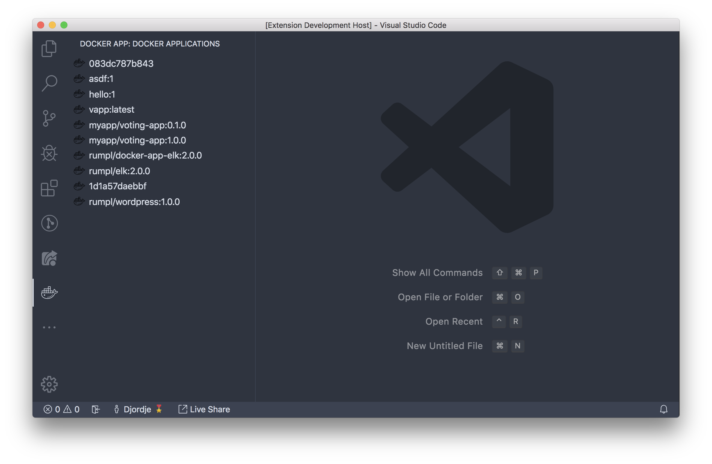

# docker-app vscode plugin

A WIP [docker app](https://github.com/docker/app) vscode plugin.

## Features

### Listing application images



```
$ docker app image ls
REPOSITORY           TAG    APP IMAGE ID APP NAME    CREATED
<none>               <none> 083dc787b843 voting-app
asdf                 1      dec0474bbea7 simple
hello                1      c1f806b1440c hello-world
vapp                 latest 5a81892da45c voting-app
myapp/voting-app     0.1.0  ed589e3978d3 voting-app
myapp/voting-app     1.0.0  0d84f65b005b voting-app
rumpl/docker-app-elk 2.0.0  3362b67cdc4e app-elk
rumpl/elk            2.0.0  3362b67cdc4e app-elk
rumpl/nick           <none> 1d1a57daebbf voting-app
rumpl/wordpress      1.0.0  3994df978068 wordpress
```

## TODO
* [x] list app images
* [ ] install an app
* [ ] stop an app
* [ ] delete an app
* [ ] many more
